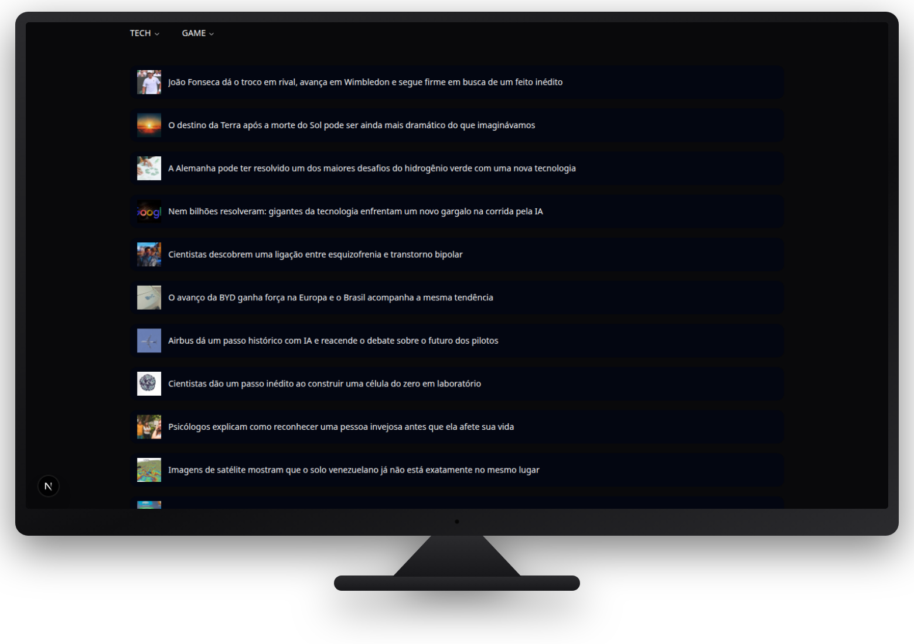
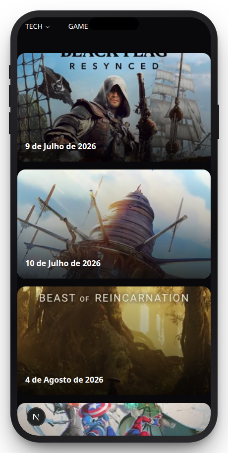

# Feed News

[https://feednews-next.vercel.app/](https://feednews-next.vercel.app/)

- Agregador de notícias de tecnologia e games. 
- Dezenas de portais brasileiros reunidos todos em um feed único — sem depender de RSS, API oficial ou banco de dados.

> Projeto pessoal construído para explorar scraping server-side, arquitetura de fontes plugáveis e as trocas entre SSG/ISR e data-fetching no client com Next.js.

<p align="center">
  
</p>

<p align="center">
  
</p>

## Sobre

- **Scraping sem RSS/API**: cada fonte é raspada sob demanda a partir do HTML público do site de origem, usando `JSDOM` no servidor — sem headless browser, sem serviço de terceiros.
- **Arquitetura de plugins**: mais de 60 fontes (tech + games) implementam a mesma interface (`ISource`), cada uma isolada em seu próprio arquivo com os seletores CSS específicos daquele site. Adicionar uma fonte nova é criar uma classe e registrá-la em um índice — nenhuma outra parte do sistema precisa mudar.
- **Resiliente a mudanças de terceiros**: como não há contrato de API entre este app e os sites raspados, os testes de integração rodam contra os sites reais (sem mocks) para detectar quando um site muda a marcação HTML ou sai do ar — e o pipeline documenta explicitamente as fontes descontinuadas em vez de apagar o histórico.
- **Ofuscação intencional da lista de fontes**: URLs de origem existem apenas como Base64 (em nomes de arquivo, imports e strings), evitando expor em texto puro no repositório a lista de sites raspados.
- **Renderização híbrida**: páginas estáticas por origem via `getStaticPaths`/ISR (revalidação a cada 2h) combinadas com `@tanstack/react-query` no client para os dados reais do feed, evitando scraping síncrono no build.

## Stack

| Camada | Tecnologias |
|---|---|
| Framework | Next.js 15 (Pages Router) + TypeScript |
| Scraping | JSDOM, parsing de HTML server-side |
| UI | Tailwind CSS, shadcn/ui (Radix UI), migração em andamento de Bootstrap/tw-elements |
| Data fetching | @tanstack/react-query, ISR (Incremental Static Regeneration) |
| Testes | Jest, Supertest — testes de integração reais contra os sites de origem |

## Como funciona

```
Cliente ──▶ /api/{tech,game}/source?url=<alias>
              │
              ▼
        sources[] filtra pela URL (alias)
              │
              ▼
   engine.getHome() ──▶ JSDOM.fromURL(site real)
              │
              ▼
   parsing com seletores CSS específicos do site
              │
              ▼
   { data: Post[], total } ──▶ feed no front-end
```

Cada fonte implementa:

```ts
interface ISource {
  getOriginUrl(): string;         // URL do site (decodificada de Base64 em runtime)
  getHome(): Promise<IResponseHomeDTO>; // faz o scraping e retorna os posts
}
```

Não existe banco de dados nem cache persistente: cada chamada à rota de API dispara o scraping ao vivo da fonte solicitada.

## Rodando localmente

Requer Node `>=24.0.0`.

```bash
pnpm install
pnpm dev
```

Abra [http://localhost:3000](http://localhost:3000).

## Scripts

```bash
pnpm dev                    # servidor de desenvolvimento
pnpm build                  # build de produção
pnpm start                  # serve o build de produção
pnpm lint                   # next lint

pnpm test                   # suíte Jest completa
pnpm test:e2e:apitech       # testes de integração das fontes de tecnologia
pnpm test:e2e:apigame       # testes de integração das fontes de games
```

Os testes de integração fazem requests HTTP reais contra os sites de origem (sem mocks) — são lentos e podem falhar se um site terceiro mudar de marcação ou ficar fora do ar, o que é esperado e não indica necessariamente um bug no código deste repositório.

## Estrutura do projeto

```
src/
├── pages/
│   ├── api/{tech,game}/
│   │   ├── source.ts          # handler único por domínio
│   │   └── sources/            # uma classe por site de origem
│   ├── tech/[slug].tsx         # página dinâmica por origem (tech)
│   └── game/[slug].tsx         # página dinâmica por origem (games)
├── assets/json/{tech,game}/    # metadados das origens exibidas na UI
├── components/                 # componentes legados + shadcn/ui
├── hooks/                      # contexto global (settings, tema)
└── services/                   # cliente HTTP
```

## Status

Projeto de portfólio em evolução ativa: migração de UI para shadcn/ui, cobertura crescente de testes de integração e adição contínua de novas fontes de scraping.
